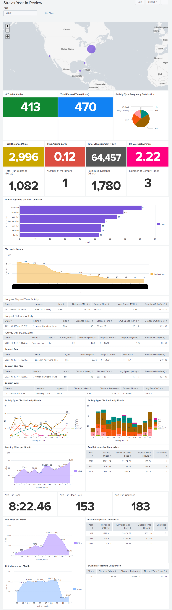

# Strava Year In Review (YIR)

This repository contains a collection of scripts and resources used to generate a Strava Year In Review (YIR) report. The inspiration came from a Spotify "wrapped" equivalent for fitness exercises tracked in Strava.

## Resources

`config.yml` -- Configuration file with secrets, output file paths, and other parameters. <br>
`strava_auth.py` -- Handles authentication to Strava. You will need the target user to grant permission to a Strava developer application to read a user's exercise data. This requires a client_id and client_secret in `config.yml` for your developer application. <br>
`strava_collection.py` -- Performs data collection from user's profile. Data is stored in a serialized python pickle and csv.<br>
`yir.py` -- Provide summary statistics in JSON after reading in python pickle to Pandas dataframe.<br>
`strava_yir.spl` -- Splunk Dashboard source code. Leverages CSVs generated by strava_collection.py.<br>

## Summary Analysis
```
{
    "2022": {
        "num_events": 433,
        "total_elapsed_time": {
            "seconds": 1692292,
            "minutes": 28204.87,
            "hours": 470.08
        },
        "longest_elapsed_time": {
            "seconds": 35513,
            "minutes": 591.88,
            "hours": 9.86,
            "activity": "\"{\\\"resource_state\\\":2,\\\"athlete\\\":{\\\"id\\\":38198630,\\\"resource_state\\\":1},\\\"name\\\":\\\"Hike in & Marcy\\\",\\\"distance\\\":23392.4,\\\"moving_time\\\":25381,\\\"elapsed_time\\\":35513,\\\"total_elevation_gain\\\":1108.0,\\\"type\\\":\\\"Hike\\\",\\\"sport_type\\\":\\\"Hike\\\",\\\"workout_type\\\":null,\\\"id\\\":7905548336,\\\"start_date\\\":\\\"2022-09-30T14:09:38Z\\\",\\\"start_date_local\\\":1664532578000,\\\"timezone\\\":\\\"(GMT-05:00) America\\\\/New_York\\\",\\\"utc_offset\\\":-14400.0,\\\"location_city\\\":null,\\\"location_state\\\":null,\\\"location_country\\\":null,\\\"achievement_count\\\":0,\\\"kudos_count\\\":16,\\\"comment_count\\\":2,\\\"athlete_count\\\":1,\\\"photo_count\\\":0,\\\"trainer\\\":false,\\\"commute\\\":false,\\\"manual\\\":false,\\\"private\\\":false,\\\"visibility\\\":\\\"everyone\\\",\\\"flagged\\\":false,\\\"gear_id\\\":null,\\\"start_latlng\\\":[44.100810634,-74.0446552075],\\\"end_latlng\\\":[44.1136536375,-73.993045399],\\\"average_speed\\\":0.922,\\\"max_speed\\\":2.747,\\\"average_cadence\\\":54.7,\\\"average_temp\\\":17.0,\\\"has_heartrate\\\":true,\\\"average_heartrate\\\":105.4,\\\"max_heartrate\\\":149.0,\\\"heartrate_opt_out\\\":false,\\\"display_hide_heartrate_option\\\":true,\\\"elev_high\\\":1572.4,\\\"elev_low\\\":531.8,\\\"upload_id\\\":8450843416,\\\"upload_id_str\\\":\\\"8450843416\\\",\\\"external_id\\\":\\\"garmin_ping_241520739556\\\",\\\"from_accepted_tag\\\":false,\\\"pr_count\\\":0,\\\"total_photo_count\\\":3,\\\"has_kudoed\\\":false,\\\"average_watts\\\":null,\\\"kilojoules\\\":null,\\\"device_watts\\\":null,\\\"max_watts\\\":null,\\\"weighted_average_watts\\\":null,\\\"start_date_local_day_of_week\\\":4}\""
        },
        "avg_elapsed_time": {
            "seconds": 3908,
            "minutes": 65.13,
            "hours": 1.09
        },
        "total_distance": {
            "meters": 4821430,
            "miles": 2995.9,
            "kilometers": 4821.43,
            "trips_around_the_world": 0.12
        },
        "max_distance": {
            "meters": 179365,
            "miles": 111.45,
            "kilometers": 179.37,
            "activity": 0
        },
        "avg_distance": {
            "meters": 11134,
            "miles": 6.92,
            "kilometers": 11.13
        },
        "total_elevation_gain": {
            "meters": 19646,
            "feet": 64455.38,
            "miles": 12.21,
            "trips_to_mt_everest_summit": 2.22
        },
        "sport_type_distribution": {
            "Run": 202,
            "Swim": 93,
            "Ride": 67,
            "WeightTraining": 61,
            "Workout": 6,
            "Hike": 4
        },
        "activity_day_freq_distribution": {
            "int": {
                "5": 81,
                "0": 69,
                "6": 65,
                "2": 57,
                "1": 54,
                "3": 54,
                "4": 53
            },
            "days": {
                "Monday": 69,
                "Tuesday": 54,
                "Wednesday": 57,
                "Thursday": 54,
                "Friday": 53,
                "Saturday": 81,
                "Sunday": 65
            }
        }
    },
    "2021": {
        "num_events": 268,
        "total_elapsed_time": {
            "seconds": 1060839,
            "minutes": 17680.65,
            "hours": 294.68
        },
        "longest_elapsed_time": {
            "seconds": 23361,
            "minutes": 389.35,
            "hours": 6.49,
            "activity": "\"{\\\"resource_state\\\":2,\\\"athlete\\\":{\\\"id\\\":38198630,\\\"resource_state\\\":1},\\\"name\\\":\\\"Morning Hike\\\",\\\"distance\\\":19079.3,\\\"moving_time\\\":19157,\\\"elapsed_time\\\":23361,\\\"total_elevation_gain\\\":1151.1,\\\"type\\\":\\\"Run\\\",\\\"sport_type\\\":\\\"Run\\\",\\\"workout_type\\\":0.0,\\\"id\\\":5980299511,\\\"start_date\\\":\\\"2021-09-17T12:21:05Z\\\",\\\"start_date_local\\\":1631866865000,\\\"timezone\\\":\\\"(GMT-05:00) America\\\\/New_York\\\",\\\"utc_offset\\\":-14400.0,\\\"location_city\\\":null,\\\"location_state\\\":null,\\\"location_country\\\":null,\\\"achievement_count\\\":0,\\\"kudos_count\\\":2,\\\"comment_count\\\":0,\\\"athlete_count\\\":1,\\\"photo_count\\\":0,\\\"trainer\\\":false,\\\"commute\\\":false,\\\"manual\\\":false,\\\"private\\\":false,\\\"visibility\\\":\\\"followers_only\\\",\\\"flagged\\\":false,\\\"gear_id\\\":null,\\\"start_latlng\\\":[44.149405,-73.767968],\\\"end_latlng\\\":[44.149636,-73.76757],\\\"average_speed\\\":0.996,\\\"max_speed\\\":3.6,\\\"average_cadence\\\":56.7,\\\"average_temp\\\":null,\\\"has_heartrate\\\":true,\\\"average_heartrate\\\":113.0,\\\"max_heartrate\\\":164.0,\\\"heartrate_opt_out\\\":false,\\\"display_hide_heartrate_option\\\":true,\\\"elev_high\\\":1433.7,\\\"elev_low\\\":386.0,\\\"upload_id\\\":6356631474,\\\"upload_id_str\\\":\\\"6356631474\\\",\\\"external_id\\\":\\\"garmin_push_7511247779\\\",\\\"from_accepted_tag\\\":false,\\\"pr_count\\\":0,\\\"total_photo_count\\\":0,\\\"has_kudoed\\\":false,\\\"average_watts\\\":null,\\\"kilojoules\\\":null,\\\"device_watts\\\":null,\\\"max_watts\\\":null,\\\"weighted_average_watts\\\":null,\\\"start_date_local_day_of_week\\\":4}\""
        },
        "avg_elapsed_time": {
            "seconds": 3958,
            "minutes": 65.97,
            "hours": 1.1
        },
        "total_distance": {
            "meters": 2491899,
            "miles": 1548.39,
            "kilometers": 2491.9,
            "trips_around_the_world": 0.06
        },
        "max_distance": {
            "meters": 83769,
            "miles": 52.05,
            "kilometers": 83.77,
            "activity": 0
        },
        "avg_distance": {
            "meters": 9298,
            "miles": 5.78,
            "kilometers": 9.3
        },
        "total_elevation_gain": {
            "meters": 14887,
            "feet": 48841.86,
            "miles": 9.25,
            "trips_to_mt_everest_summit": 1.68
        },
        "sport_type_distribution": {
            "Run": 149,
            "WeightTraining": 75,
            "Ride": 25,
            "Elliptical": 12,
            "Walk": 3,
            "Hike": 2,
            "InlineSkate": 1,
            "Workout": 1
        },
        "activity_day_freq_distribution": {
            "int": {
                "1": 47,
                "5": 43,
                "6": 39,
                "4": 38,
                "0": 37,
                "2": 37,
                "3": 27
            },
            "days": {
                "Monday": 37,
                "Tuesday": 47,
                "Wednesday": 37,
                "Thursday": 27,
                "Friday": 38,
                "Saturday": 43,
                "Sunday": 39
            }
        }
    },
    "2020": {
        "num_events": 69,
        "total_elapsed_time": {
            "seconds": 368705,
            "minutes": 6145.08,
            "hours": 102.42
        },
        "longest_elapsed_time": {
            "seconds": 21740,
            "minutes": 362.33,
            "hours": 6.04,
            "activity": "\"{\\\"resource_state\\\":2,\\\"athlete\\\":{\\\"id\\\":38198630,\\\"resource_state\\\":1},\\\"name\\\":\\\"South Arapahoe Peak Hike\\\",\\\"distance\\\":18948.2,\\\"moving_time\\\":17565,\\\"elapsed_time\\\":21740,\\\"total_elevation_gain\\\":1205.3,\\\"type\\\":\\\"Walk\\\",\\\"sport_type\\\":\\\"Walk\\\",\\\"workout_type\\\":null,\\\"id\\\":4117054333,\\\"start_date\\\":\\\"2020-09-26T13:02:06Z\\\",\\\"start_date_local\\\":1601103726000,\\\"timezone\\\":\\\"(GMT-07:00) America\\\\/Denver\\\",\\\"utc_offset\\\":-21600.0,\\\"location_city\\\":null,\\\"location_state\\\":null,\\\"location_country\\\":null,\\\"achievement_count\\\":0,\\\"kudos_count\\\":0,\\\"comment_count\\\":0,\\\"athlete_count\\\":1,\\\"photo_count\\\":0,\\\"trainer\\\":false,\\\"commute\\\":false,\\\"manual\\\":false,\\\"private\\\":false,\\\"visibility\\\":\\\"followers_only\\\",\\\"flagged\\\":false,\\\"gear_id\\\":null,\\\"start_latlng\\\":[39.994595,-105.634173],\\\"end_latlng\\\":[39.990169,-105.628916],\\\"average_speed\\\":1.079,\\\"max_speed\\\":4.4,\\\"average_cadence\\\":53.1,\\\"average_temp\\\":null,\\\"has_heartrate\\\":true,\\\"average_heartrate\\\":100.9,\\\"max_heartrate\\\":142.0,\\\"heartrate_opt_out\\\":false,\\\"display_hide_heartrate_option\\\":true,\\\"elev_high\\\":4037.3,\\\"elev_low\\\":3062.6,\\\"upload_id\\\":4405344913,\\\"upload_id_str\\\":\\\"4405344913\\\",\\\"external_id\\\":\\\"garmin_push_5596254434\\\",\\\"from_accepted_tag\\\":false,\\\"pr_count\\\":0,\\\"total_photo_count\\\":3,\\\"has_kudoed\\\":false,\\\"average_watts\\\":null,\\\"kilojoules\\\":null,\\\"device_watts\\\":null,\\\"max_watts\\\":null,\\\"weighted_average_watts\\\":null,\\\"start_date_local_day_of_week\\\":5}\""
        },
        "avg_elapsed_time": {
            "seconds": 5343,
            "minutes": 89.05,
            "hours": 1.48
        },
        "total_distance": {
            "meters": 632365,
            "miles": 392.93,
            "kilometers": 632.37,
            "trips_around_the_world": 0.02
        },
        "max_distance": {
            "meters": 42167,
            "miles": 26.2,
            "kilometers": 42.17,
            "activity": 0
        },
        "avg_distance": {
            "meters": 9164,
            "miles": 5.69,
            "kilometers": 9.16
        },
        "total_elevation_gain": {
            "meters": 12322,
            "feet": 40426.51,
            "miles": 7.66,
            "trips_to_mt_everest_summit": 1.39
        },
        "sport_type_distribution": {
            "Run": 43,
            "Walk": 13,
            "Workout": 6,
            "WeightTraining": 3,
            "Ride": 3,
            "Elliptical": 1
        },
        "activity_day_freq_distribution": {
            "int": {
                "5": 14,
                "6": 13,
                "1": 10,
                "0": 10,
                "4": 9,
                "2": 7,
                "3": 6
            },
            "days": {
                "Monday": 10,
                "Tuesday": 10,
                "Wednesday": 7,
                "Thursday": 6,
                "Friday": 9,
                "Saturday": 14,
                "Sunday": 13
            }
        },
        "kudos": {
            "XXXXXXXXXXX": 223,
            "XXXXXXXXXXX": 214,
            "XXXXXXXXXXX": 197,
            ...
            ...
            ...
            "XXXXXXXXXXX": 189
        }
    }
}
```

## Splunk Dashboard Report



## Capitalize


